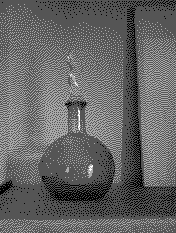
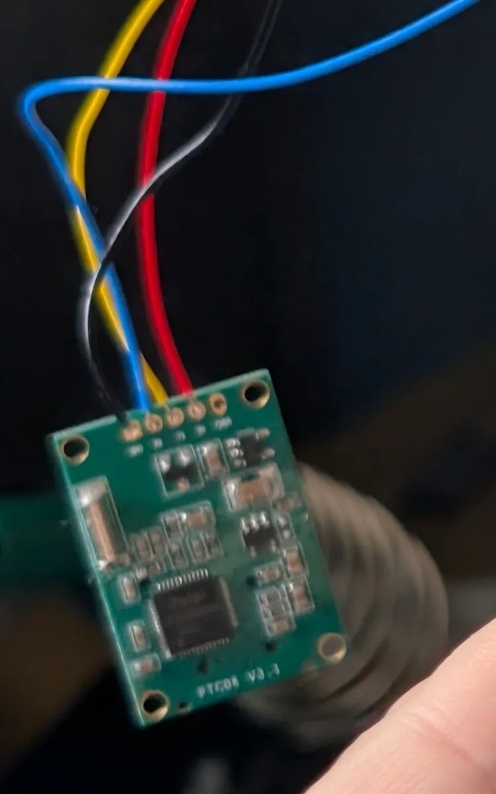
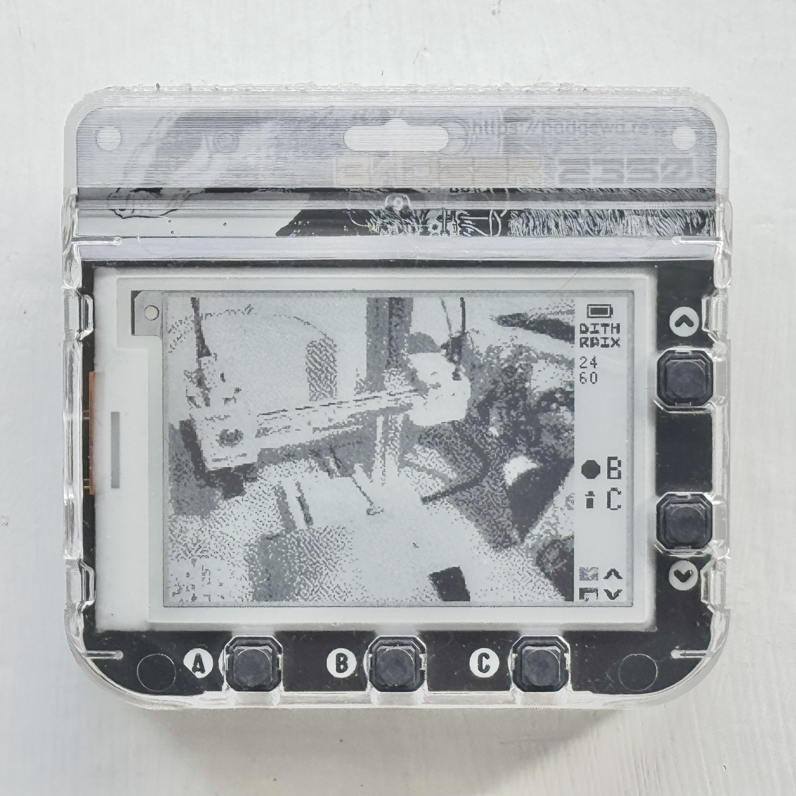
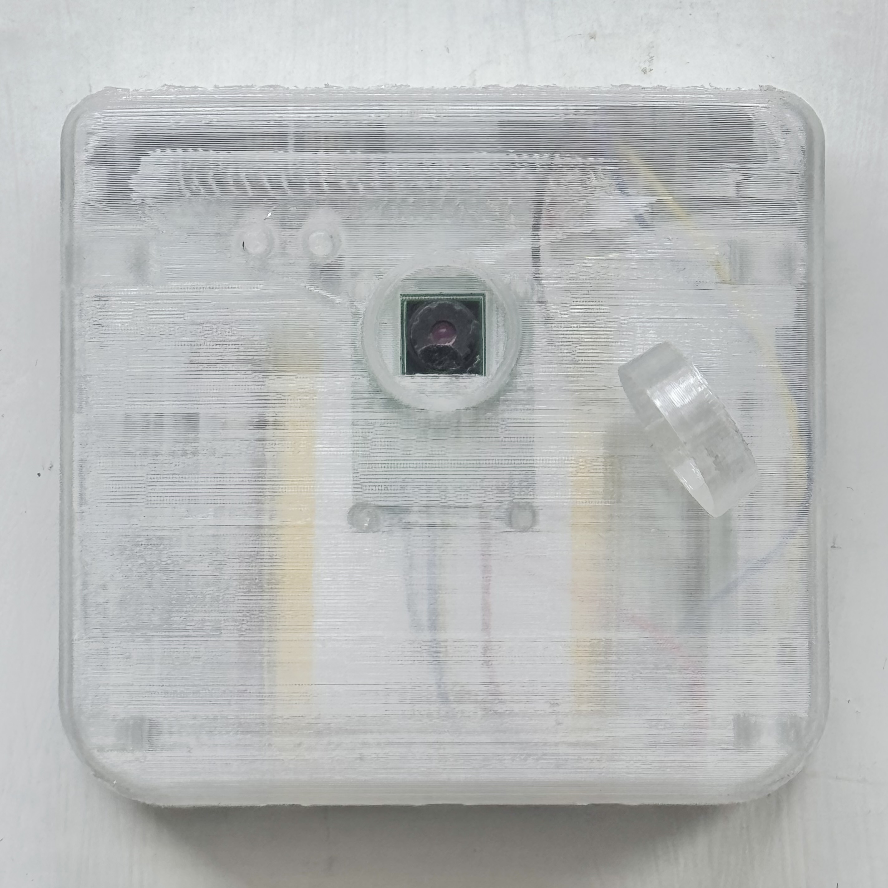

Do you love the old retro aesthetic of dithered photos from the early internet? 

Were you lucky enough to have a [Game Boy Camera](https://en.wikipedia.org/wiki/Game_Boy_Camera)?

Do you LOVE e-ink screens?

Do you have a [Pimoroni Badger 2350](https://shop.pimoroni.com/products/badger-2350) knocking around? (If not, you totally should.)

If you answered yes to any of the above, this project is for you!

If you want to get straight to building or see the code, [here's the README guide](https://github.com/jonothanhunt/dithrpix#guide).

## Why

A sentiment I've been hearing recently is *"the best camera is the one you enjoy the most"*.

For a year or so, I've been collecting old film cameras at car boot sales, putting film in them, and testing them for the month. The limitations of the medium are what make it so fun; not seeing the captured photo immediately, dealing with dodgy controls, and wrestling with broken exposure meters all make for very exciting reveals at [Snappy Snaps](https://www.snappysnaps.co.uk/).

Old digital cameras are great fun to use too; the gimmicky features and effects, and huge stick-out lenses which wrap sensors we'd not even use as a webcam today, give them so much character.

I like my Pixel and iPhone for taking photos and have tried both power-user apps for raw-level controls and oppositely-styled apps which apply significant post-processing to achieve simulated film grain or digital effects like dithering. They're great fun, but the phone form factor still feels too polished.

*I want whimsy.* 

This was my motivation. My first thought was my Badger 2350 from Pimoroni's Badgeware range, and I figured out it was possible to connect a specific type of camera module to it. Just think of all the fun limitations to build around! Bandwidth limitations, e-ink limitations, battery limitations, storage limitations!

After the bits arrived, creating the app, soldering on the camera, and designing and 3D printing the case in [Blender](https://www.blender.org/) only took the weekend as I recovered from a cold. Most of the time is just the 3D printing and soldering, which is probably doable in a leisurely few hours. 

I am thrilled with the result!

I'm super into translucent tech, and I love how the clear filament I used for this looks! Even the colourful cables directionally diffused by the printed layers. The case fits well, but the front cover isn't quite as secure as I'd like; I may follow up with a second version if I can figure it out. Or perhaps someone else will (it's all open source and [open to contributions](https://github.com/jonothanhunt/dithrpix), if you're a CAD wizard!).

The Badgeware OS gives apps only 1MB to play with for permanent storage, so that's about 60 dithered photos from my testing; that's almost double what I can get on one roll of film! 

I've been bumbling around taking photos of random stuff. The seconds of wait for the screen to refresh with the image, and needing to cycle the exposure window and dithering algorithm to get the best shot, make each one even more rewarding.

It's been so fun building this. I will make improvements to it as I use it. Given the camera is a fair bit higher res than the capture size, perhaps digital zoom will be a nice addition, but I'll need to figure out how to do this given the limited button selection—all of which are already in use!

Perhaps a flash would be fun to add using the lights on the back of the Badger!

'Til next time!
