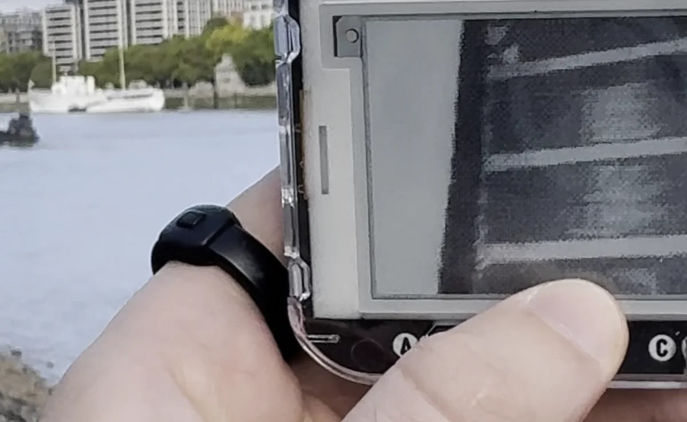
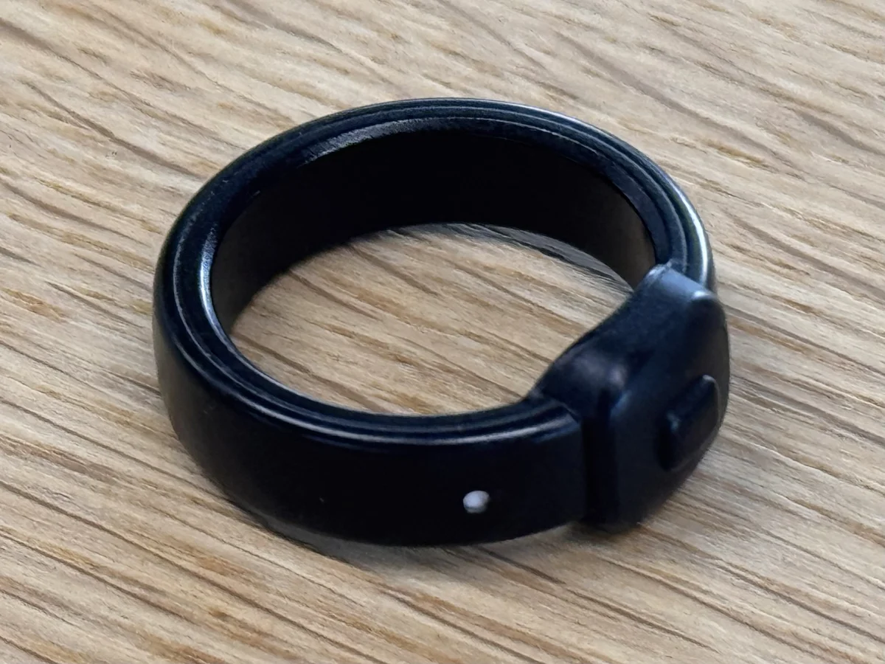
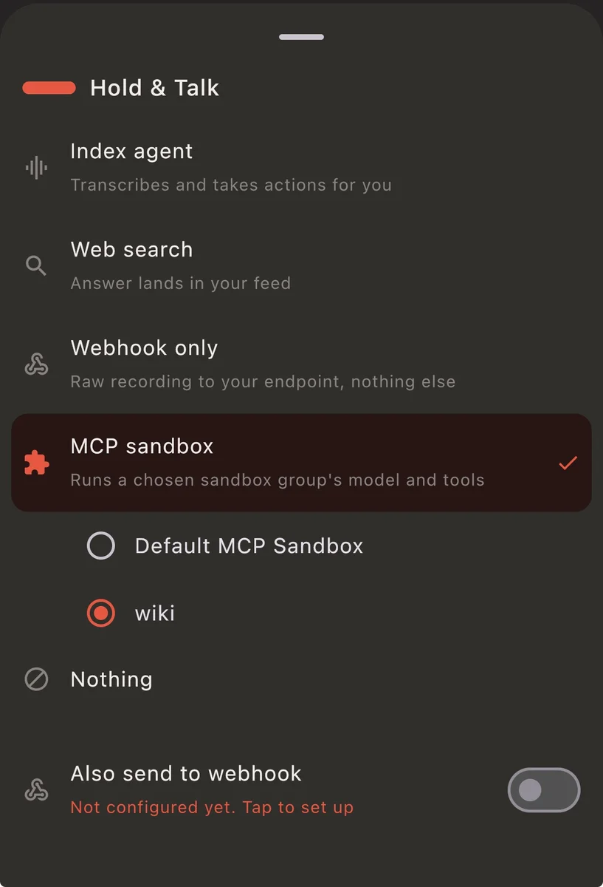
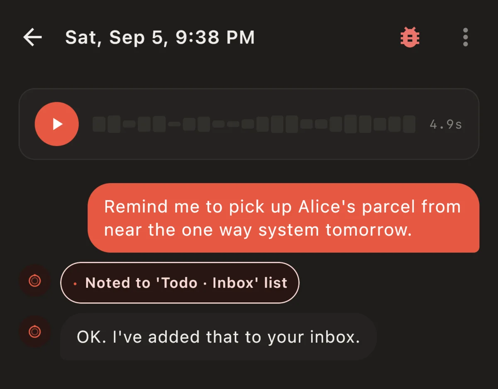
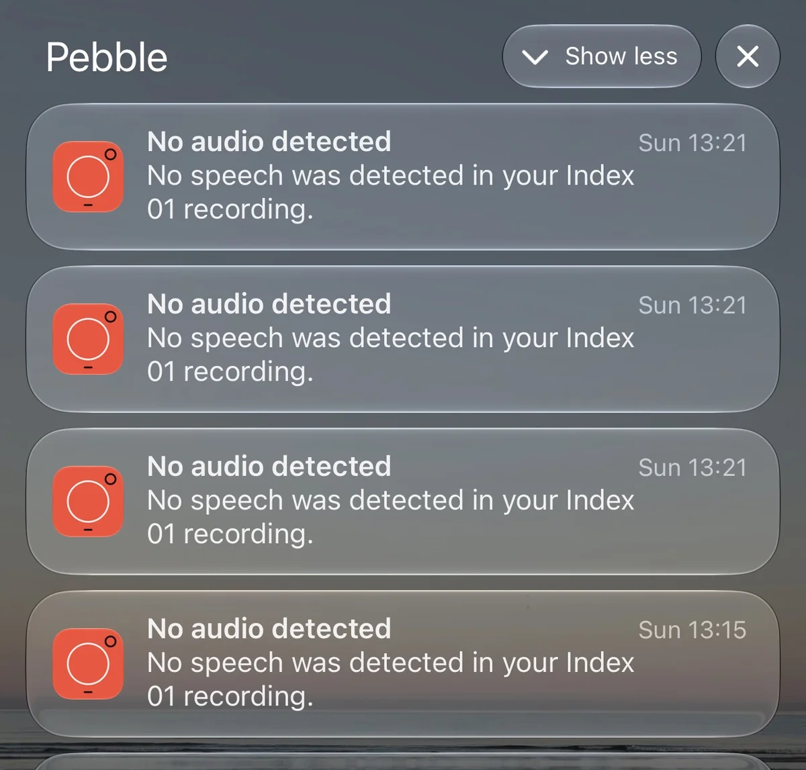
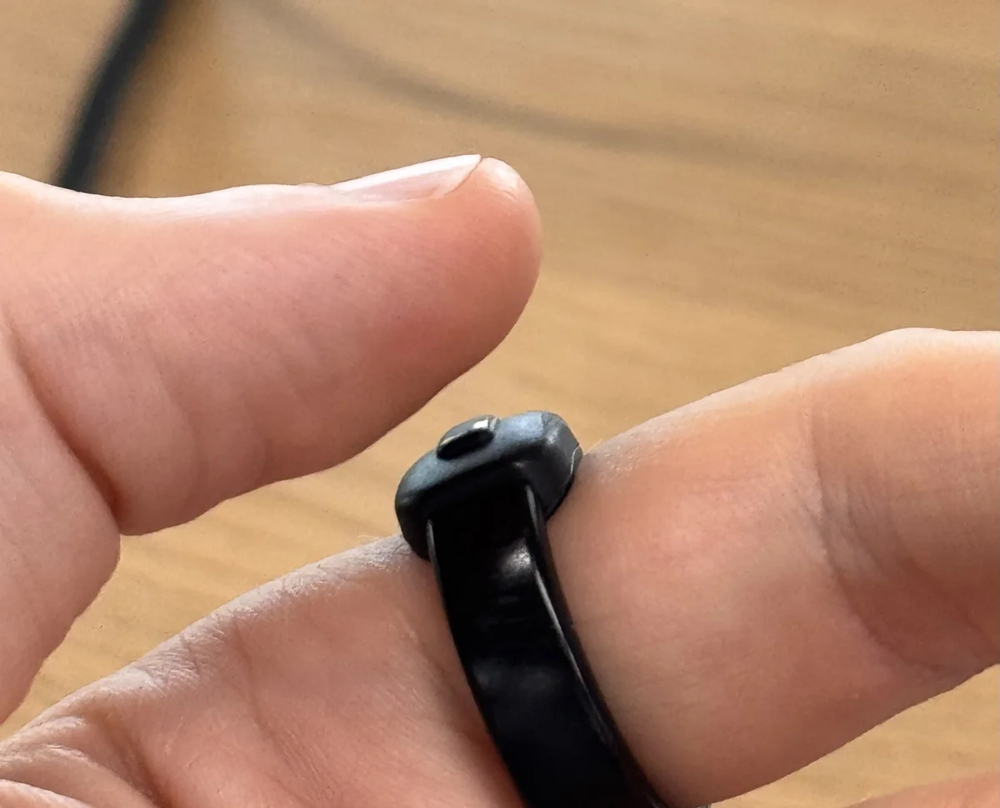

This is my review of the Index 01 after a month of usage.

## What it is

In [Core Devices' words](https://repebble.com/index):

> …a small ring with a button and microphone. Press the button, whisper your thought, and it's sent to your phone. It's added to your notes, set as a reminder, or saved for later review.

## TL;DR

Does what it says on the tin and more, and surprisingly smooth for a first gen product.

## Fit

I 3D-printed both [sizing kits](https://github.com/coredevices/hardware/tree/main/ring/pebble-index-01). Found little differences between them. The ring itself is ever-so-slightly smaller than the sizing ring was.

## Toughness

I'd expect not to experience much damage in a month of wear of anything designed to last 2+ years, and yet I'm pleasantly surprised how the intense bumps, scrapes, rain and washing up have barely left a mark.

## Functionality

Everything promised has worked flawlessly for me. The UX of the app could do with some love, but it ain't bad. Web research is prompt.

Saving notes and to-dos is near instant too. It's faster to use than Siri on Apple Watch or the phone because it's so instant to just hold and talk.

I created an MCP for the hold gesture to save my notes/todos to my Git wiki setup. Set it up in under an hour with Claude in a Cloudflare worker and it has worked every time since.

## Issues

The only issue I've had with it is accidental clicks. They have little consequence so no biggy, but it happens once or twice a day generally, and always when playing guitar, so removing it is best. I hope V2 of the Index has a harder to click, less sticky-outy (both outwards and width) button that detects a finger pressing (capacitive?) if clicked and ignores it if it's a cold click.

I'd have liked there to be a way to combine the web research feature and other tools into a single call in the Pebble app so just one gesture could handle all the functionality whilst keeping another gesture for my own MCP. No doubt this will become a possibility.

## How often did I think I'd use it vs. actually?

I assumed a few times a day. In reality, some days 5+ times and some days not at all! I'm right next to my to-do list and notes most of my working day, but when travelling or at the weekend, it gets use!

The web research feature is nice, and I like the result appearing on my Pebble watch, but as it turns out, most things I search for, I actually want a visual result for.

## Value for money

I paid ~£70 I believe, for which the fun tinkering and ease of building it into my own workflow have been well worth it.
